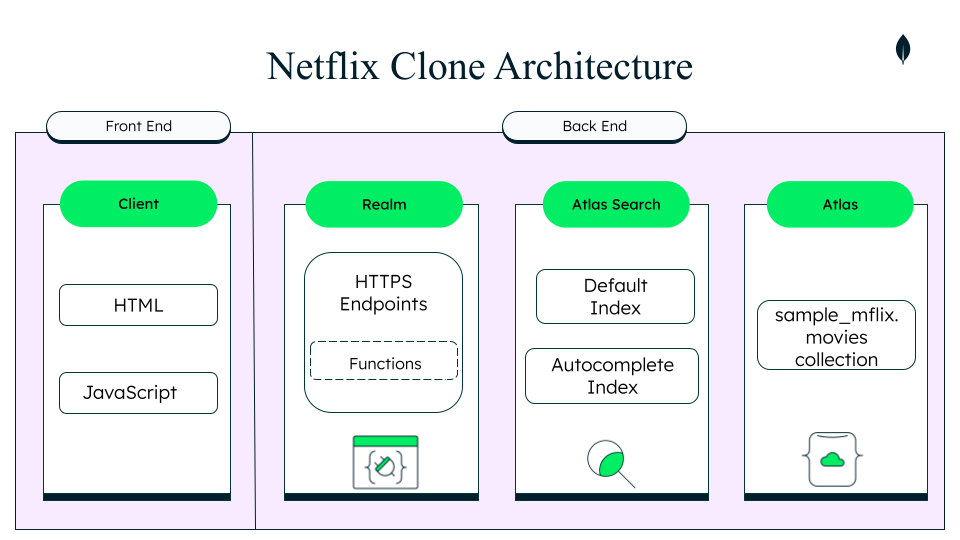

## MongoDB Netflix Clone

<h3>Atlas Search Workshop
</h3>

Hello! 👋 This movie search application allows you to search lightning fast through a wide variety of data types through the sample_mflix.movies dataset offered free to download on MongoDB Atlas.

 

 

 The MongoDB Netflix Clone implements many Atlas Search features from autocomplete to custom function scoring. Using the $search operator in a MongoDB aggregation pipeline, we can build fine-grained searches across text, numerics, and geospatial data. By building out this application, you'll learn all sorts of ways MongoDB allows you to build complex, fine-grained full-text searches on your Atlas data.

**No additional servers or software needed. No need to keep data in sync. Everything is done in MongoDB Atlas.**

Current features implemented in this Movie Search Engine demo application include:

- fuzzy matching
- highlighting
- autocomplete
- relevance-based scoring
- custom function scoring

Future Atlas Search features to implement can include:

- [ ] facets
- [ ] synonyms

<h2 align="center"><a href="netflixclone-xwaaq.mongodbstitch.com/">netflixclone-xwaaq.mongodbstitch.com</a></h2>

This application was created using:

- React
- MongoDB Realm for backend HTTPs endpoints and webhooks
- The Atlas sample dataset of sample_mflix.movies

<h3>API Points of Integration</h3>
This application is hosted entirely on Realm and calls 2 API endpoints:
 
 * getProductsEndpoint in the Home.js page on line 24
 * Suggestions_AC_Endpoint, used for autocompleted product names, in the Header.js component on line 17.

<em>Currently this app is not suitable for mobile, but feel free to send a PR.</em> 😊

<h3>Prerequisites</h3>

- A MongoDB Atlas account. Get one for free <a href="https://www.mongodb.com/cloud/atlas">here.</a>
- A recent version of Node.js and npm.
- Atlas sample dataset
- (Recommended) <a href="https://www.mongodb.com/try/download/compass">MongoDB Compass - GUI</a>

This application is hosted entirely by MongoDB Atlas was created using:

- React
- MongoDB Realm for backend HTTPs endpoints and webhooks
- MongoDB's Atlas sample_mflix dataset

    

<h2>Prepare Data</h2>

<ol>
<li> Load data to Atlas cluster:
<ul>
<li>database: <code>sample_mflix</code></li>
<li>collection: <code>movies</code></li>
</ul>
</li>

<li> Create Search indexes.</li>
</ol>

<h2>To Build and Run This Application....</h2>

1. Clone the repo.
2. Navigate inside directory.
3. Run <code>npm install</code> .
4. Run <code>npm start </code> .

Runs the app in the development mode.\
Open [http://localhost:3000](http://localhost:3000) to view it in your browser.

### Atlas Search Workshop:

https://www.atlassearchworkshop.com

React Components:
 

 

If you have any questions or feedback about this repo, feel free to create an Issue or PR in this repo or reach out to me on Twitter @YouOldMaid.

Also please join our online <a href="https://developer.mongodb.com/community/forums/">MongoDB Community</a> to interact with our product and engineering teams along with thousands of other MongoDB and Realm users.   Have fun and happy coding!
